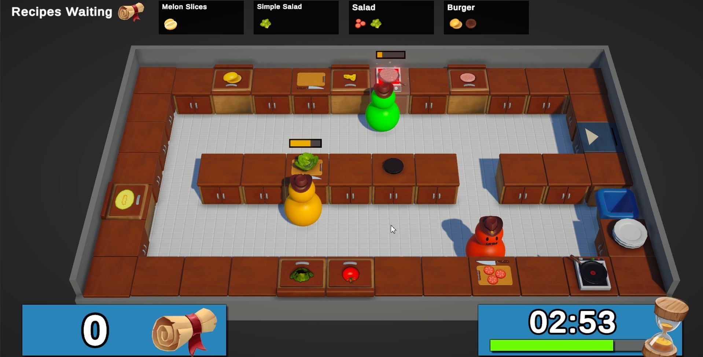

# About the project:

___"Hell's Kitchen"___ is my own pet project. It's a multiplayer game for PC and consoles with the ability to play up to four people. It is reminiscent of Overcooked2

___Players___ are given the opportunity to create public and private lobbies. There is also a waiting room for players and the game it self is synchronized. 

___The game___ has customizable controls that allow players to configure controls on both the keyboard and gamepads. 

___The single game___ mode is also present. If the player wants to play without a net and one, he can do it.

## How to play the game

Download this zip archive __[zip file]("Hell's Kitchen.zip")__, unpack it and run the executable file Hell’s Kitchen.exe. 

## Used plugins:

* New Input System
* NetCode
* Unity Lobby
* TextMeshPro (TMP)
* Universal Render Pipeline (URP)
* Unity Relay
* Cinemachine
* Scriptable Objects

## System requirements:

The project requires the Unity Environment 2022.2.8f1 or higher to work with it.

## Project installation:

To install the project, download it from GitHub and open it in Unity. Then, open MainMenuScene scene and click on the "Play" button to start the project.

## Contribution to the project:

The project is open source, and we welcome contributions to its development. If you discover bugs or want to add new features, please submit a pull request to GitHub.

## Contacts:

If you have any questions or suggestions, please contact us through our GitHub or [Telegram](https://t.me/janitoor13).
